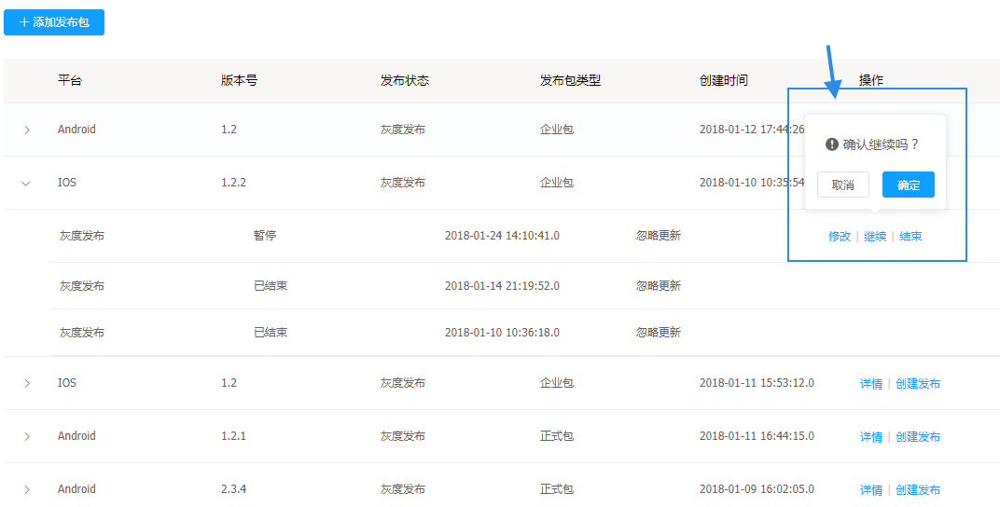

# 发布版本

发布管理功能是客户端升级新版本的配置后台，支持用户创建多任务，多维度的升级配置。

## 发布管理的功能

---

* 增加升级资源
* 创建、修改新版本资源包的任务
* 创建多种类型的任务(多名单灰度，时间窗灰度，正式发布)
* 支持多种条件的升级过滤（城市，机型，osVersion，网络，版本）

## 发布管理的操作说明

---

进入 Flame 内管控制台，点击左侧导航栏中的**实时发布** > **发布管理**

步骤 1 进入发布管理列表

步骤 2 点击**添加发布包**增加新版本资源

升级包分两种，一种是 Android 一种是 iOS ，iOS 又分为企业包和正式包（正式包需要多输入一个 App Store 地址，在正式发布时提示用户到 App Store 升级），企业包只能进行白名单灰度，而正式包灰度可以进行白名单和时间窗，但前提是只有越狱手机才能收到提示。

步骤 3 点击 + 查看升级包的发布任务

如果升级包未发布过，当前包的状态为待发布，并且没有任务发布任务

如果升级包发布过，当前包的状态为最新任务的发布状态，并且有相关的发布任务

步骤 4 创建发布任务

* 白名单（白名单的选择在白名单管理中配置）

> 注意：如果发布包类型是IOS的企业包，发布包类型没有正式类型，灰度发布模式采有时间窗

* 时间窗

* 高级规则（高级规则的选择在资源管理中配置）

> 修改发布任务 同步骤4

步骤 5 变更升级包的发布任务

* 继续任务（继续的任务可以进行暂停操作）

* 结束任务（结束的任务不能再做任何操作）

