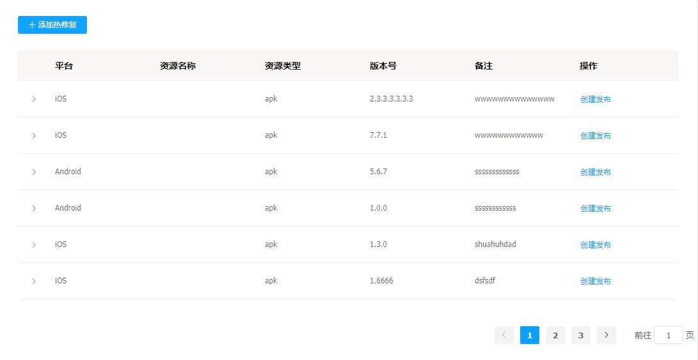
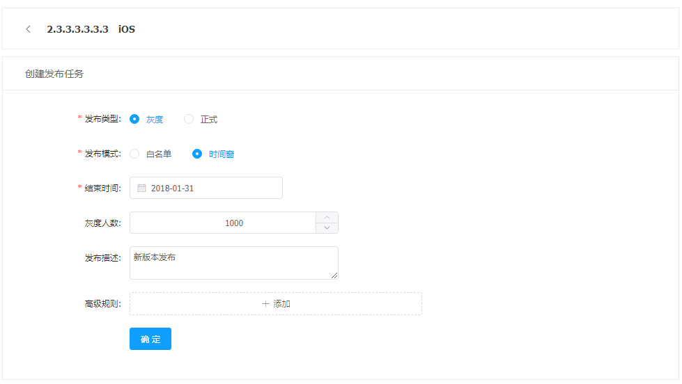
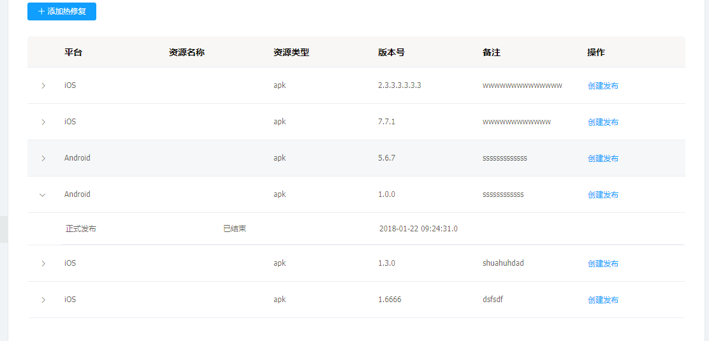

# 热修复管理

---

热修复管理是客户端升级新版本的配置后台，支持用户创建多任务，多维度的热修复配置。

热修复的功能

* 增加版本的热修复包
* 创建、修改热修复资源包的任务
* 创建多类型的任务(多名单灰度，时间窗灰度，正式发布)
* 支持多种条件的升级过虑（城市，机型，osVersion，网络，版本）

## 热修复的操作说明

---

进入 falme 内管控制台，点击左侧导航栏中的**实时发布** > **发布管理**

步骤 1 进入热修复发布列表

步骤 2 点击**增加热修复**增加 hotpatch 资源

热修复包分两种，一种是 Android 一种是 iOS。其中 Android 客户端的热修复，一个版本最多只能有一个热修复包，如果一个客户端的一个版本有两个 bug，请先在本地将两个 bug 的热修复包合成一个。再进行上传。注意 **Android 添加热修复** 界面中的 **目标版本号** 是指 Portal 包的版本号。

步骤 3 点击 + 查看升级包的发布任务

如果资源包未发布过，当前包的状态为待发布，并且没有任务发布任务。其中一个 hotpatch 资源在同一时间只能有一个有效的发布任务。

如果升级包发布过，当前包的状态为最新任务的发布状态，并且有相关的发布任务。

步骤 4 创建发布任务

* 白名单（白名单的选择在白名单管理中配置）

* 时间窗

* 高级规则（高级规则的选择在资源管理中配置）

步骤 5 变更发布任务

* 暂停任务（暂停的任务可以进行继续操作）

* 结束任务（结束的任务不能再做任何操作）

