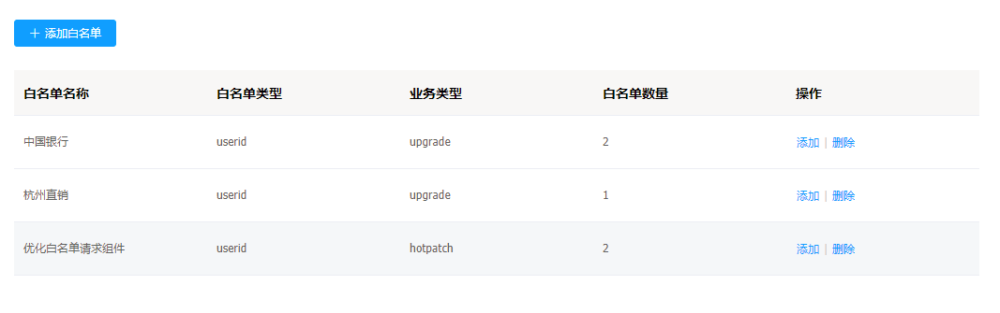
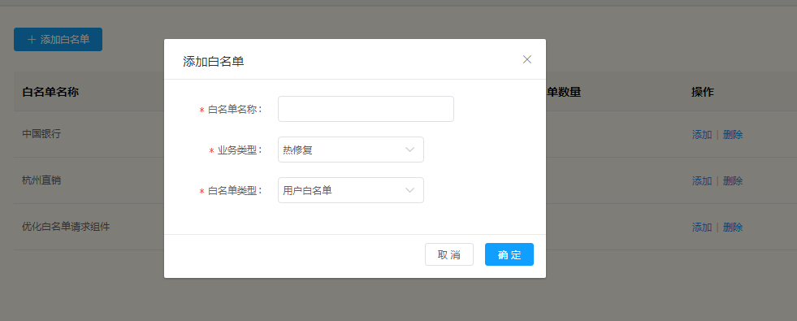
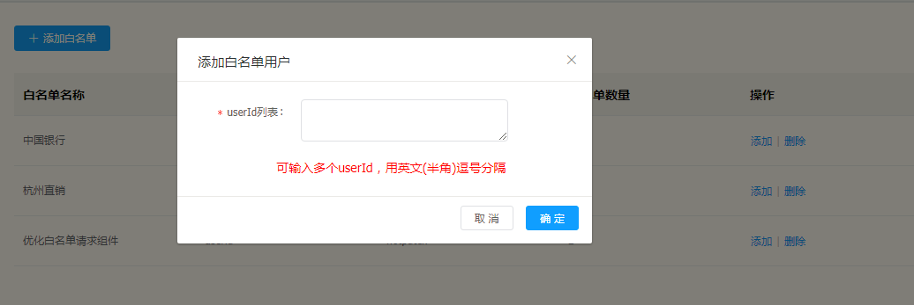
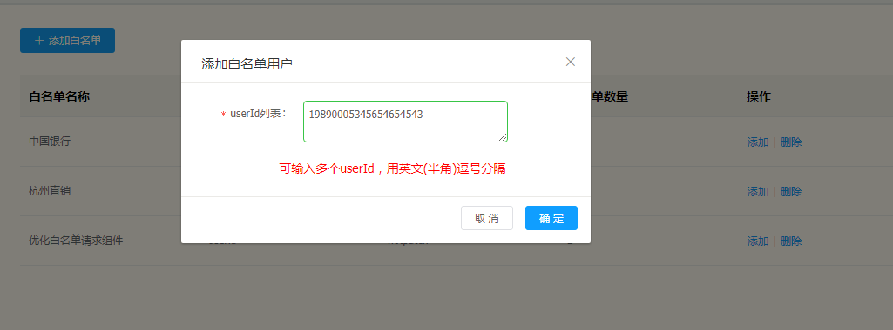
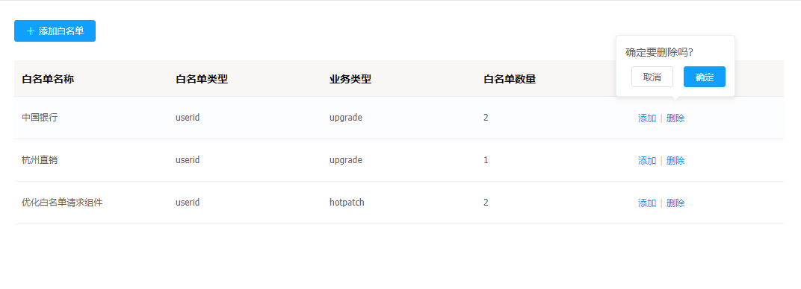

# 白名单管理

---

白名单管理是一个实时发布的基础功能，它为实时发布提供了一个白名单的管理平台，用户可以轻松创建十万级的白名单数据，并且被实时发布使用。

## 白名单功能

---

* 创建白名单及信息
* 增加白名单的用户信息

## 白名单操作说明

---

进入 flame 内管控制台，点击左侧导航栏中的 **实时发布** > **白名单管理**

步骤 1 进入白名单列表

步骤 2 增加白名单配置

步骤 3 增加白名单信息

步骤 4 输入白名单信息

步骤 5 删除白名单信息

