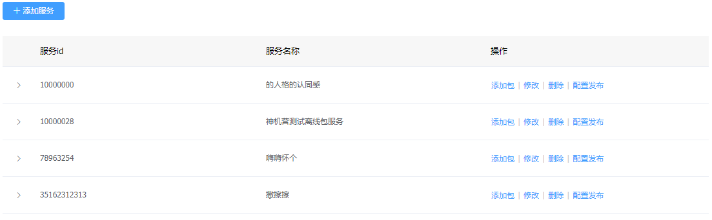

# 离线包管理

---

离线包管理是客户端的H5页面所需的静态资源包管理和发布的后台，支持用户创建多任务，多维度的离线包配置。该部分内容较多，本节只阐述该页面上操作，部分具体操作请移步至[离线包详情](离线包详情.md)以及[配置发布](离线包配置发布.md)

## 离线包管理功能

---

* 增加服务
* 修改服务
* 删除服务
* 配置发布
* 查看服务下的包
* 添加服务下的包
* 修改服务下的包
* 删除服务下的包

## 离线包操作说明

---

进入 Flame 内管控制台，点击左侧导航栏中的 **实时发布** > **离线包管理**

步骤 1 进入离线包管理

步骤 2 添加新的服务

步骤 3 服务下添加包

步骤 4 查看服务下的包

> 到该步骤，您就可以点击对应要发布的包的 **详情** 按钮，来上传离线包。具体步骤，见[离线包详情](离线包详情.md)。

步骤 5 服务配置发布

> 到该步骤，您就可以点击对应要发布的服务的 **配置发布** 按钮，来上传离线包。具体步骤，见[配置发布](离线包配置发布.md)。

步骤 6 剩余修改、删除操作较为简单，所以不再介绍。

> 值得注意的是，如下图所示：服务下可能会有部分离线包右上角有New字样，这表示您新建了包以后却没有在[配置发布](离线包配置发布.md)中将该包发布出去，以此来提示您是否需要重新发布。

