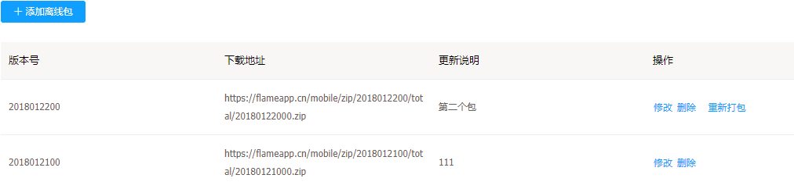
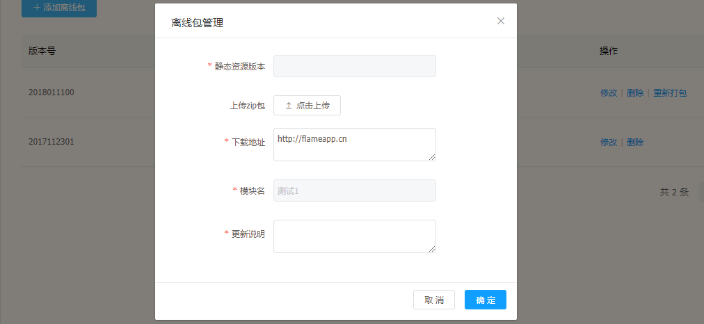
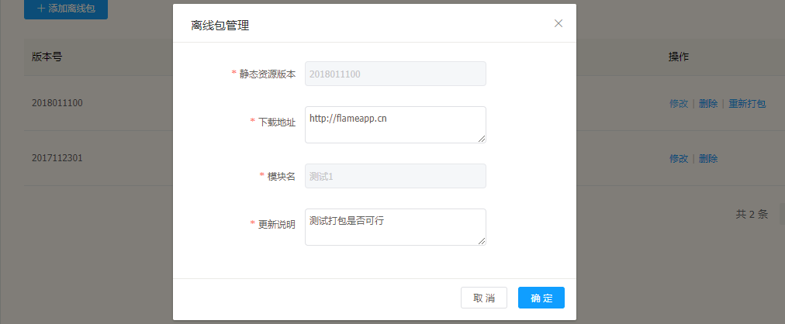
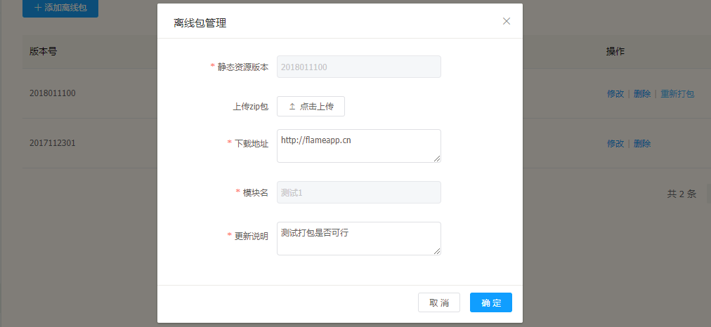
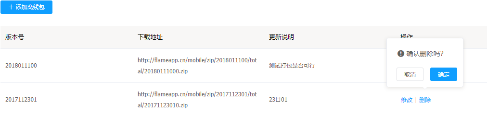

# 离线包详情

---

离线包详情是离线包管理里的一个子功能，可以在这里进行上传、删除离线包等操作

## 离线包详情功能

---

* 添加离线包
* 修改离线包
* 删除离线包
* 对离线包重新打包

## 离线包操作说明

---

进入 Flame 内管控制台，点击左侧导航栏中的 **实时发布** > **离线包管理** > **展开服务** > **详情**

步骤 1 进入离线包详情

步骤 2 添加新的离线包

> 点击 **上传zip包** 成功上传后，会自动获取zip包的名字作为静态版本号。zip包名字格式为年月日加上两位数的编号，如：2018020100。

步骤 3 修改离线包

步骤 4 重新打包

> 可以看到修改只能修改下载地址和更新说明，如果是zip包有问题的话，需要在重新打包里上传要替换的包来完成的。

步骤 5 删除包

> 在上传好离线包或者是重新打包后，您可以进行[配置发布](离线包配置发布.md)来将离线包推送给用户。