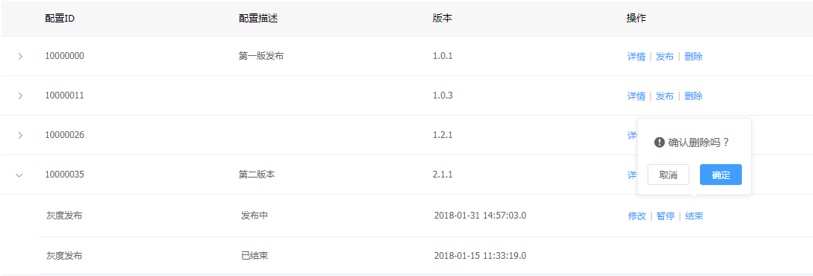

# 离线包配置发布

离线包配置发布是实时发布离线包管理中的一个基础功能。它为离线包管理中的不同服务id提供不同的配置发布，用户可以通过增加配置，添加发布来对离线包配置不同版本的发布任务。

## 配置发布功能

---

* 增加配置信息
* 创建多种类型的任务(多名单灰度，时间窗灰度，正式发布)
* 支持多种条件的升级过滤（城市，机型，osVersion，网络，版本）

## 配置发布操作说明

---

进入Flame 内管控制台，点击左侧导航栏中的 **实时发布** > **离线包管理**

步骤 1 进入离线包管理

步骤 2 点击操作栏配置发布

步骤 3 进入配置页面列表

步骤4 点击**添加配置**增加不同离线包服务ID配置

> 需要注意的是在配置内容处点击上传文件需要上传txt格式文件，其它格式文件无法上传获取文件内容，txt文件中文件内容格式需是json对象，参照{"modules": [{"moduleID":"module1","zips": [{"zipID": "10000041",
"zipVersion": "2018012100"}]}]}

步骤 5 点击 > 查看配置的发布任务

如果该配置未发布过，则点击并没有任何发布任务

如果该配置发布过，则点击有相关的发布任务

步骤 6 创建发布任务

* 白名单 (白名单的选择在实时发布白名单管理中配置)

* 时间窗

* 高级规则 (高级规则的选择在实时发布资源管理中配置)

步骤 7 变更配置的发布任务

* 暂停任务 (暂停的任务可以进行继续操作)

* 结束任务 (结束的任务不能再做任何操作)

## 配置发布注意事项

---

注意 1 配置页面列表删除功能

当点击删除按钮时，只有该配置下的发布任务为空或者所有发布任务都是已结束状态下才可以成功删除，否则不予删除操作。

注意 2 配置发布任务的操作栏

当该配置下的发布任务为正式发布时，无法进行修改按钮操作，为白名单灰度或时间窗灰度发布时，可进行修改按钮操作。

