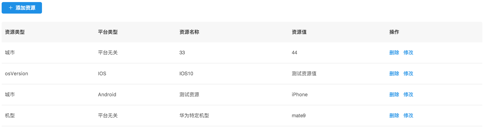
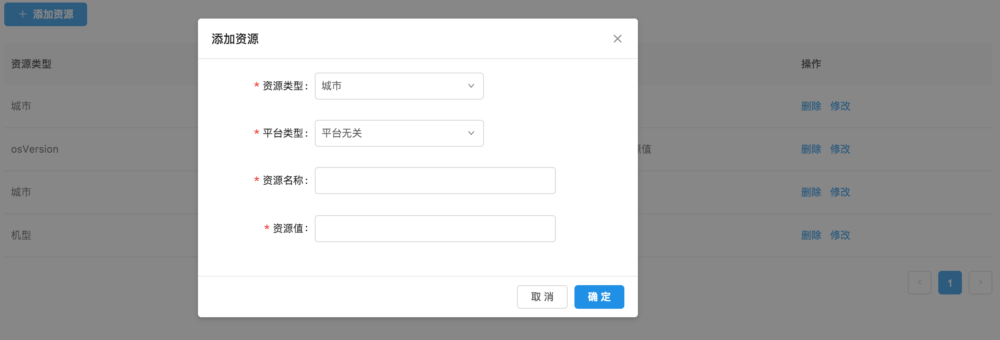
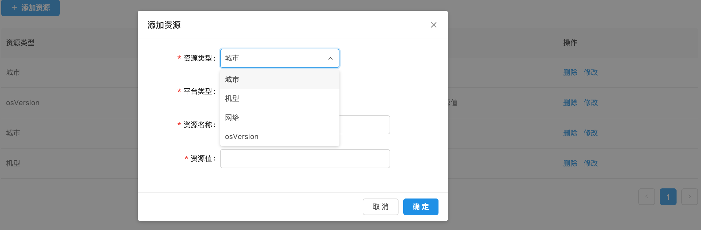
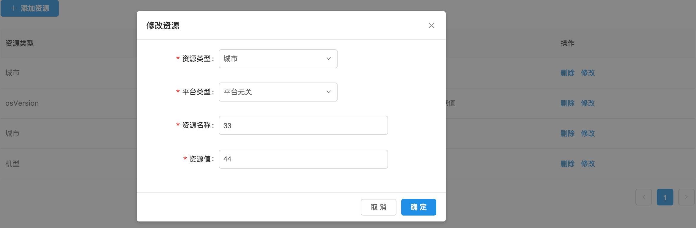
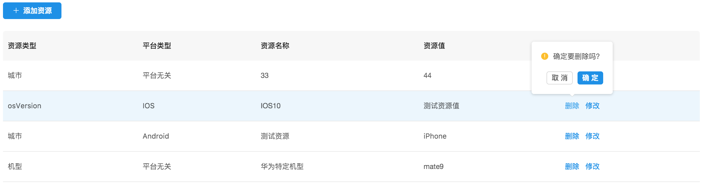

# 资源配置管理

资源配置管理是一个实时发布的基础功能，用户可以预先定义实时发布所需要的各种配置数据。不需要每次手工输入，提升效率，降低出错可能性。

各种配置数据也称为资源，比如城市，机型等。

资源配置功能：

* 增加资源
* 删除资源
* 修改资源

## 资源配置操作说明

---

进入 flame 内管控制台，点击左侧导航栏中的 **实时发布** > **资源配置管理**

步骤 1 资源配置列表

步骤 2 添加资源配置

步骤 3 选择资源配置信息

步骤 4 修改资源配置信息

步骤 5 删除资源配置信息

