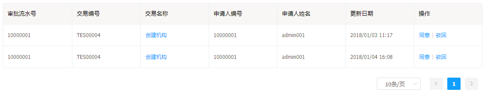
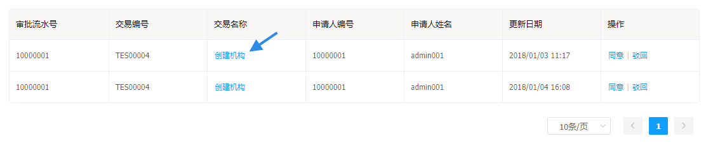
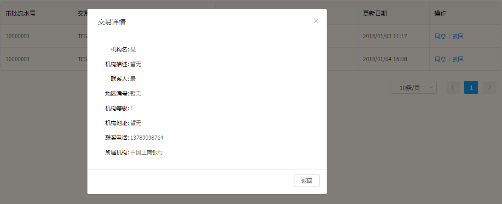
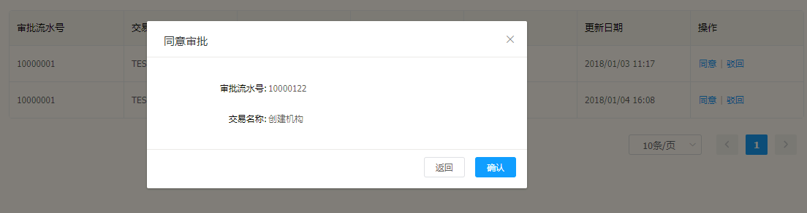
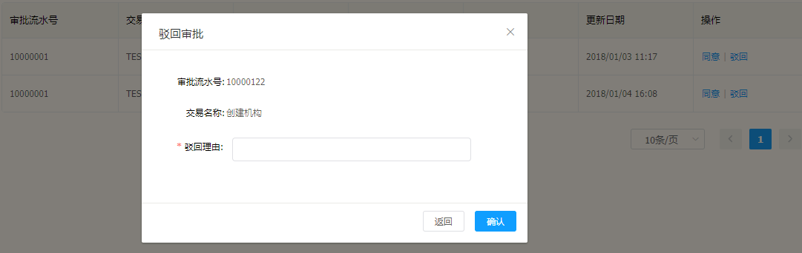

# 审查列表

审查列表功能是客户端中登录用户具有审批权限的操作。

## 审查列表的功能

---

* 审查列表
* 查看审查的详情
* 审批操作

## 审查列表的操作说明

---

进入 Flame 内管控制台，点击左侧导航栏中的**审查列表**

步骤 1 进入审查列表

功能1 点击交易名称表格项，对话框显示详情

功能2 **审批操作**

>  同意审批

* 点击 > 同意 < ，进入对话框，点击确认

> 驳回审批

* 点击 > 驳回 < 在对话框中填写**驳回理由**点击确认

