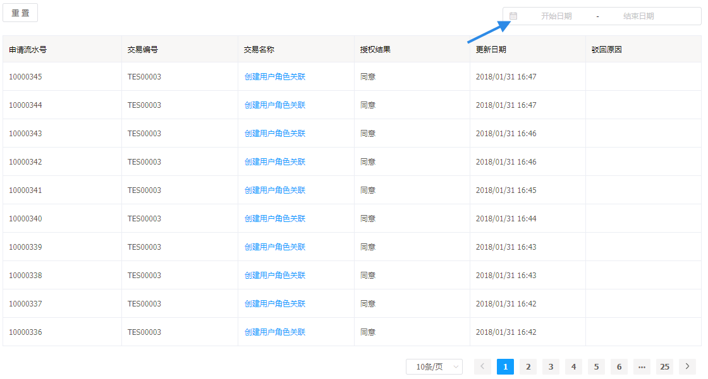

# 申请记录

申请记录功能是查看客户端登录用户进行的所有业务操作。

## 申请记录的功能

---

* 申请记录列表
* 查看审查的详情
* 审批操作

## 申请记录的操作说明

---

进入 Flame 内管控制台，点击左侧导航栏中的**申请记录**

步骤 1 进入申请记录

功能1 **页面重置**

* 点击 > 重置 < ，审查历史的表格会显示第一页，每页10条数据

功能2 点击交易名称表格项，对话框显示详情

功能3 **按照日期搜索**

* 点击日期选择框，进入日期跨度选择。选择后，列表自动呈现选中日期间的数据

