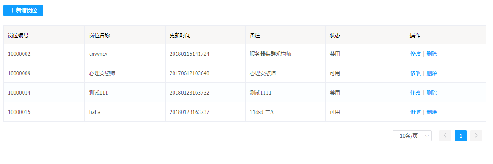
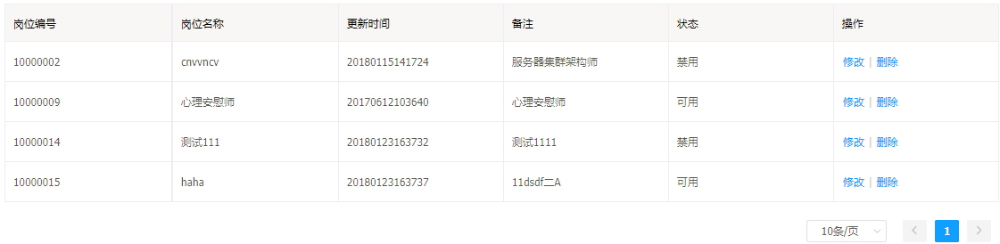
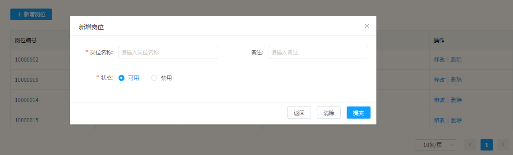
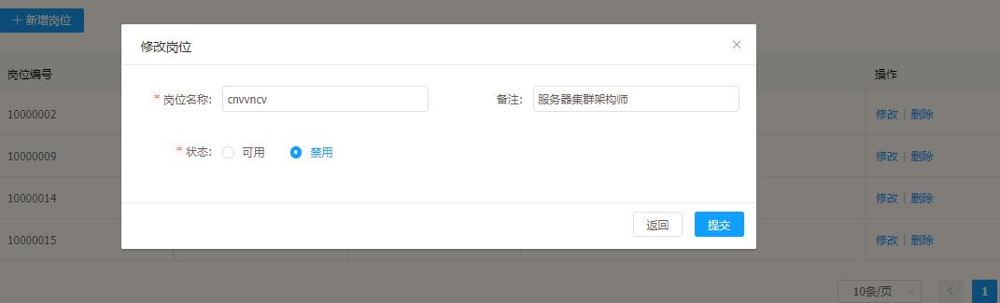
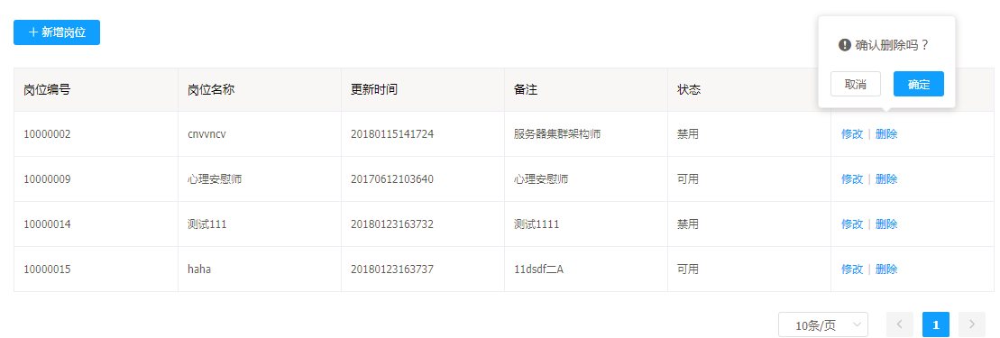

#岗位管理

岗位管理功能是客户端用户可以修改岗位名称以及状态，方便统一修改同一岗位的功能及权限修改。

## 岗位管理的功能

---

* 岗位列表
* 新增岗位
* 修改岗位
* 删除岗位

## 岗位管理的操作说明

---

进入 Flame 内管控制台，点击左侧导航栏中的**岗位管理**

步骤 1 进入岗位管理

步骤 2 分页查看岗位列表

功能1 **新增岗位**

* 点击 > 新增岗位 < 进入对话框，填写好岗位信息，确认后点击提交

功能2 **修改岗位**

* 点击 > 修改 < 进入对话框，修改数据，确认后点击提交

功能3 **删除岗位**

* 点击 > 删除 < 

