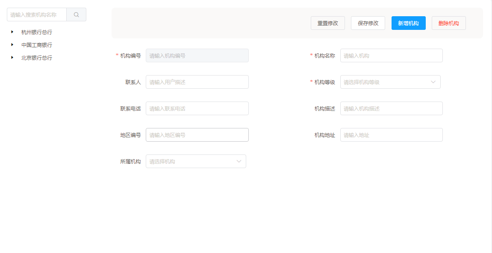
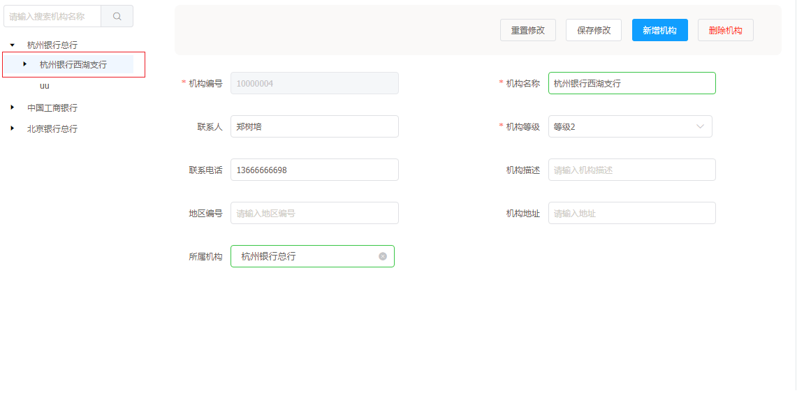
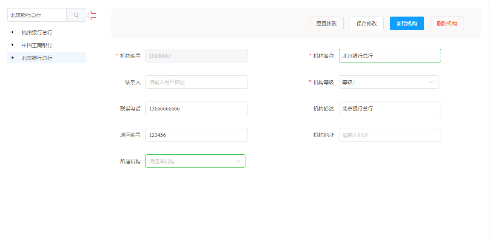
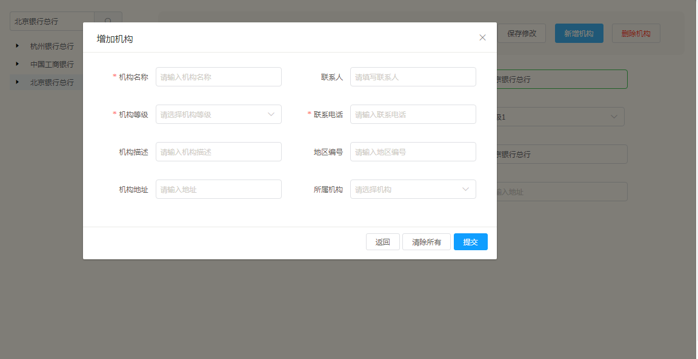
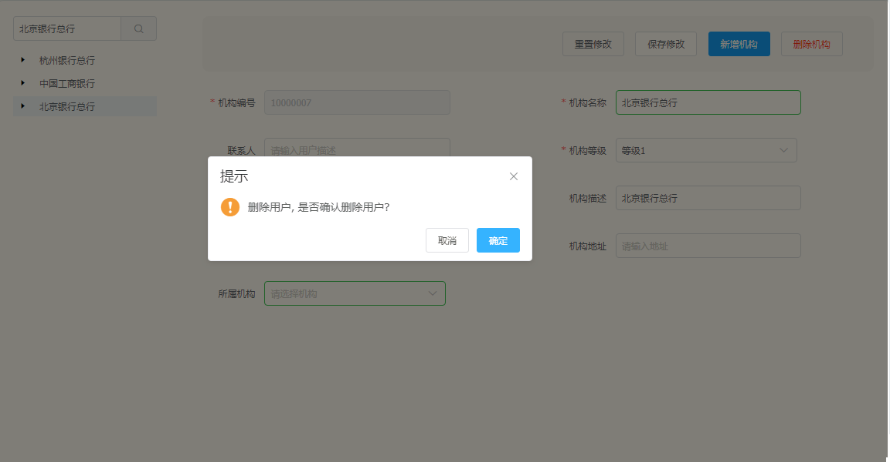
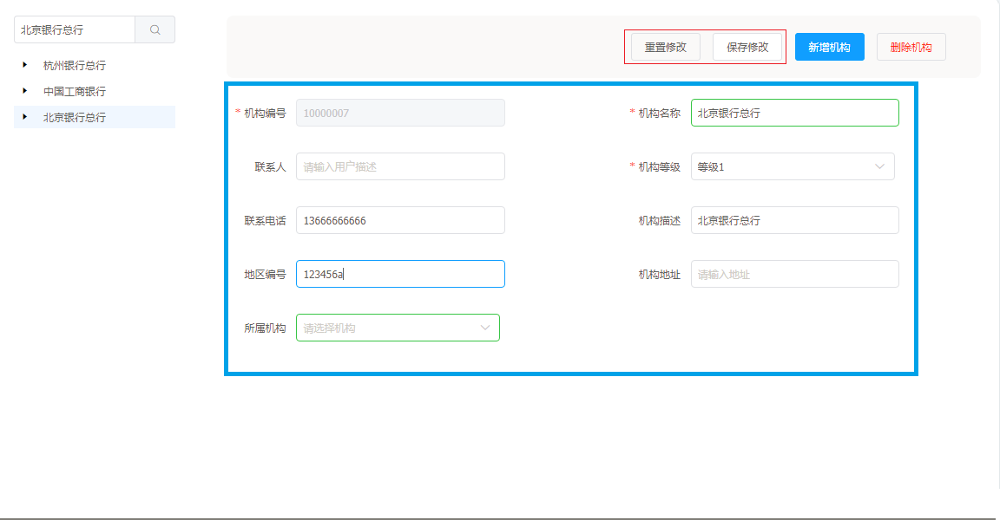

# 机构管理

机构管理是一个基础功能，用户可以预先定义机构管理的各种配置数据。

机构功能：

* 增加机构
* 保存机构
* 删除机构
* 重置修改机构
* 搜索机构

## 机构管理操作说明

---

进入 flame 内管控制台，点击左侧导航栏中的 **机构管理**

步骤 1 点击左侧导航栏中的 **机构管理**

步骤 2 点击左边的机构树，可显示机构详情

步骤 3 寻找自己想要查看的机构名称，点击搜索框的机构搜索按钮

步骤 4 点击增加机构，将预定义的机构详情填入

步骤 5 选择右边的某一机构，点击删除机构，选择选择'确定'或'取消'

步骤 6 选择右边的某一机构，可在蓝色区域在原有的详情上进行修改，点击保存修改；若想返回原有数据，单击重置修改即可

