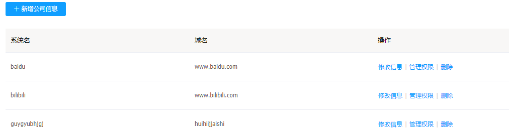
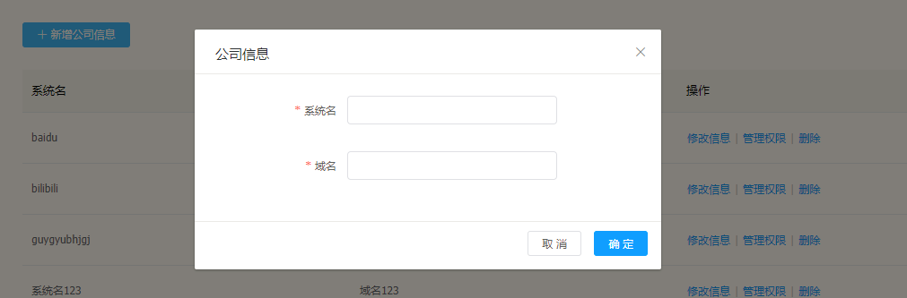
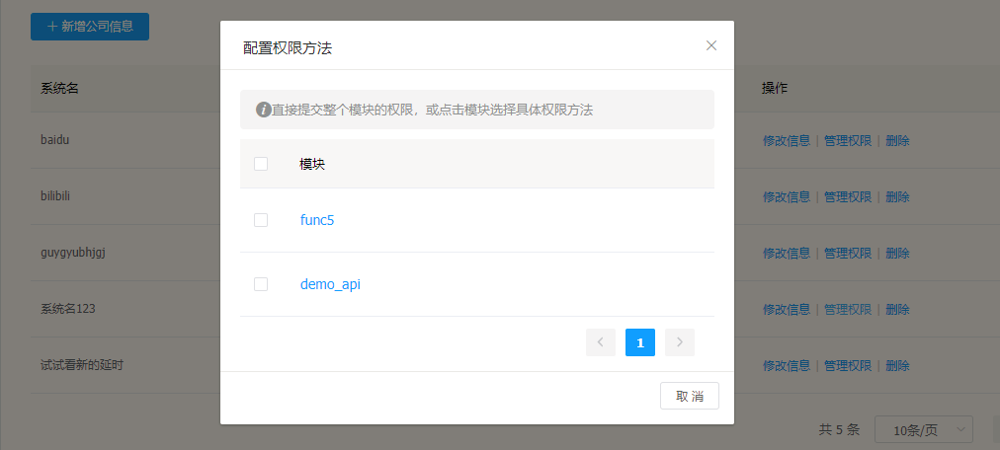
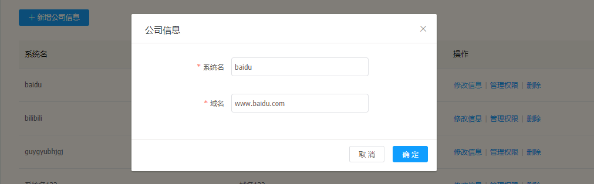
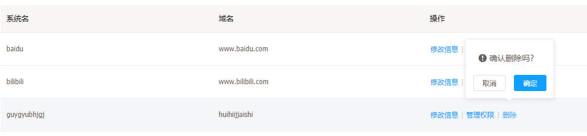

# 第三方列表

---

第三方列表配合 Flame 平台的离线包发布，可以为第三方在集成 SDK 时，提供相应信息，根据信息分配所拥有的权限。

## 第三方列表功能

---

* 增加第三方信息
* 修改第三方信息
* 管理第三方权限
* 删除第三方信息

## 第三方列表操作说明

---

进入 Flame 内管控制台，点击左侧导航栏中的 **权限管理** > **第三方管理**

步骤 1 进入第三方列表

步骤 2 添加新的第三方信息

步骤 3 管理第三方应有权限

步骤 4 修改第三方信息

步骤 5 删除第三方信息

