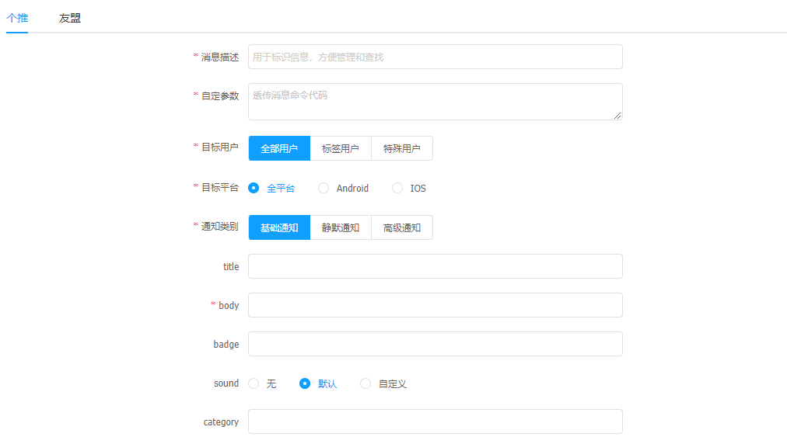
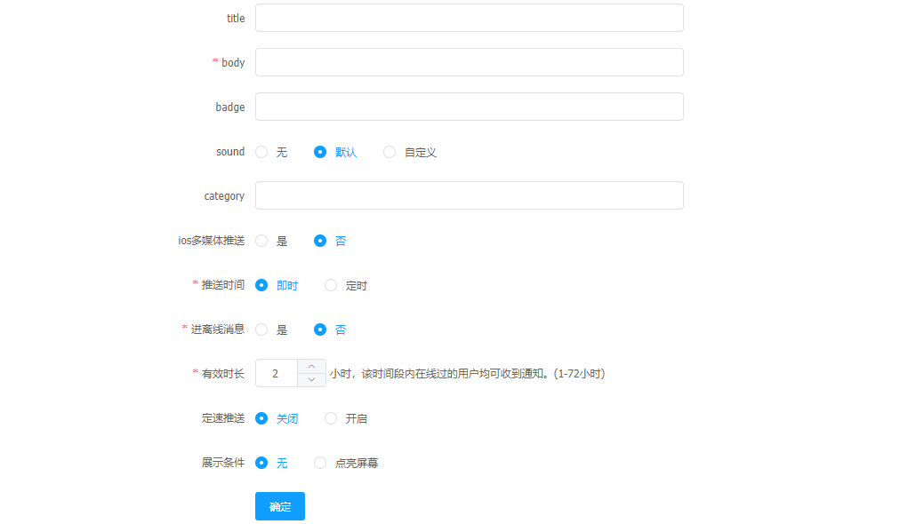

# 新建消息

---

在 flame 内管平台中，可以使用我们集成的第三方推送，向采用 flame 移动组件的手机推送消息。

## 已集成平台

---

* 个推推送
* 友盟推送

## 推送步骤说明

---

进入 flame 内管控制台，点击左侧导航栏中的 **消息推送** > **新建消息**

步骤 1 进入新建消息界面，选择希望推送的平台

步骤 2 填写消息标识，方便后续查找

步骤 3 选择目标用户、目标平台

步骤 4 填写推送信息，并发起推送

