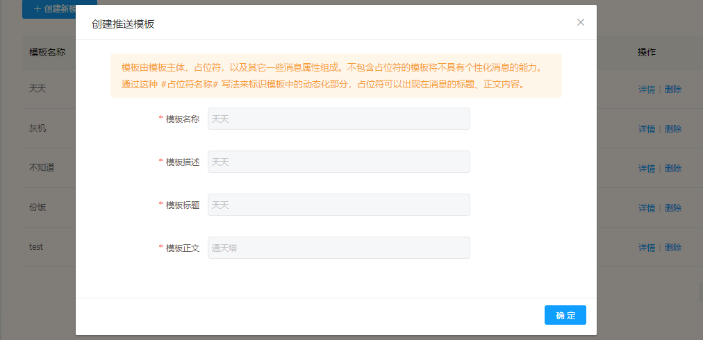

# 消息模板

---

消息模板配合 Flame 平台的新建推送消息服务，创建好消息模板后，可以在新建消息时候导入模板来快速创建推送消息。

## 消息模板功能

---

* 增加消息模板
* 消息模板详情
* 删除消息模板

## 消息模板操作说明

---

进入 Flame 内管控制台，点击左侧导航栏中的 **消息推送** > **消息模板**

步骤 1 进入消息模板

步骤 2 添加新的消息模板

步骤 3 查看消息模板详情

步骤 4 删除消息模板

