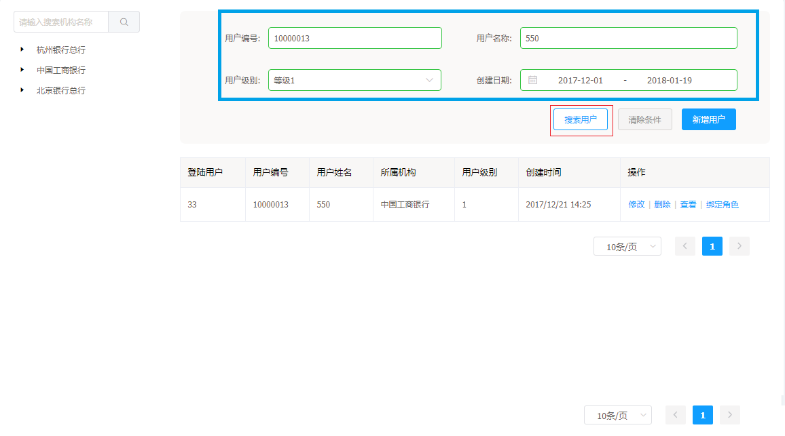
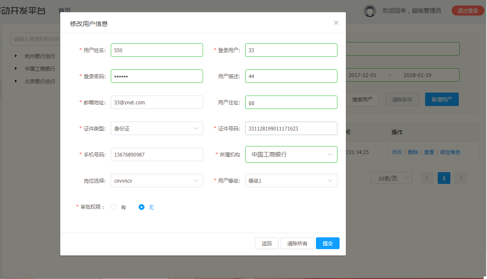

# 用户管理

用户管理是一个基础功能，用户可以对其进行配置。

用户功能：

* 用户详情
* 搜索机构匹配用户
* 条件搜索用户
* 增加用户
* 修改用户
* 删除用户
* 查看用户信息
* 用户角色绑定

## 用户管理操作说明

---

进入 Flame 内管控制台，点击左侧导航栏中的 **用户管理**

步骤 1 点击左侧导航栏中的 **用户管理**，点击左边的**机构列表**

步骤 2 输入已存在的机构，点击搜索，可显示用户详情

步骤 3 选择用户条件，点击**搜索用户**，匹配符合条件的用户

步骤 4 点击增加用户，将预定义的用户数据填入，点击**保存**

步骤 5 选择用户列表项的某一用户，点击**修改**，选择**提交**

步骤 6 选择用户列表项的某一用户，点击**删除**，选择**确定**

步骤 7 选择用户列表项的某一用户，点击**查看**，会弹出该用户的数据

步骤 8 选择用户列表项的某一用户，点击**角色绑定**，通过下拉框选择用户所绑定的角色，点击确定

