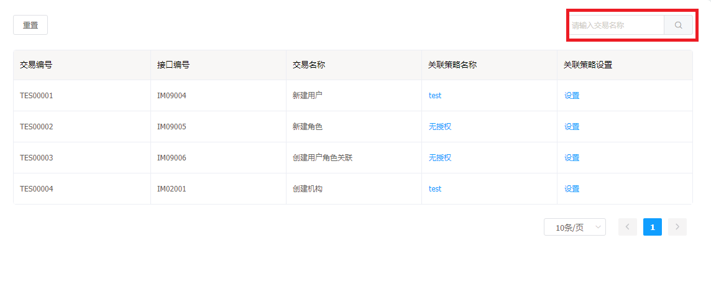
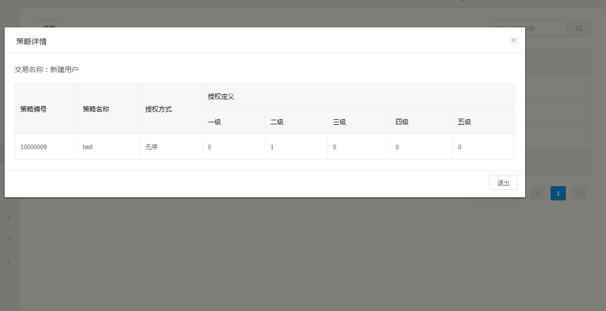
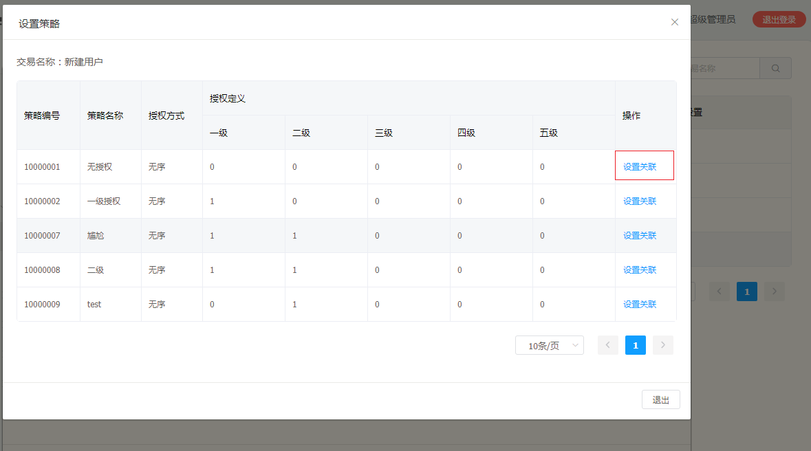
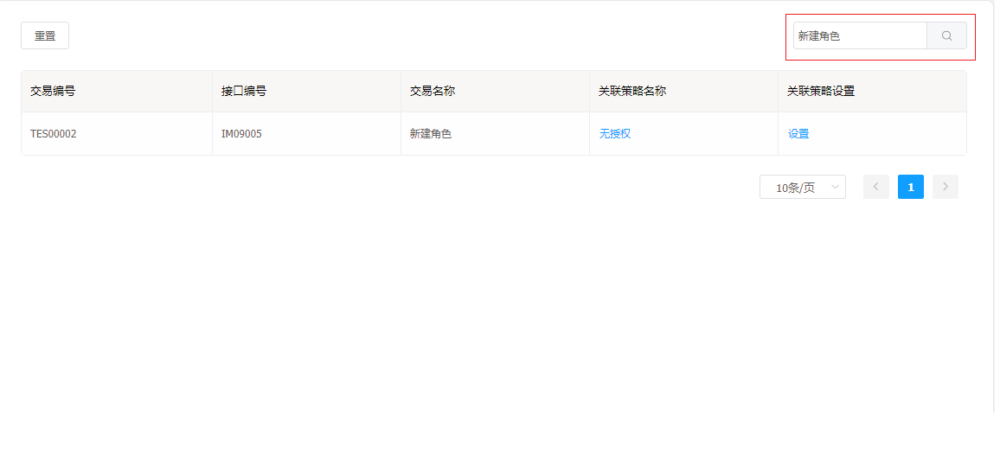

# 审查设置

审查设置可以为创建机构，新建用户，新建角色，用户角色关联设置策略关联，从而让用户使用创建功能的时遵守该策略

审查设置功能：

* 查看审查设置列表
* 查看当前的策略
* 设置关联
* 搜索交易名称

## 审查设置操作说明

---

进入 flame 内管控制台，点击左侧导航栏中的 **策略管理** > **审查设置**

步骤 1 查看审查设置列表

步骤 2 点击某一列表下的关联策略名称，会弹出当前交易名称所对应的策略列表详情

步骤 3 点击关联设置下的**设置**，会弹出策略列表，点击**设置关联**

步骤 4 将交易名称输入，点击搜索

