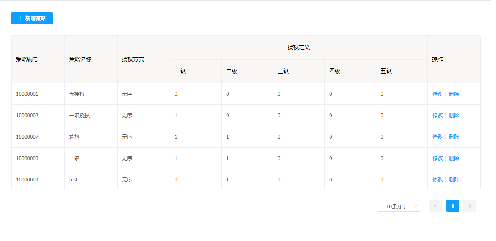
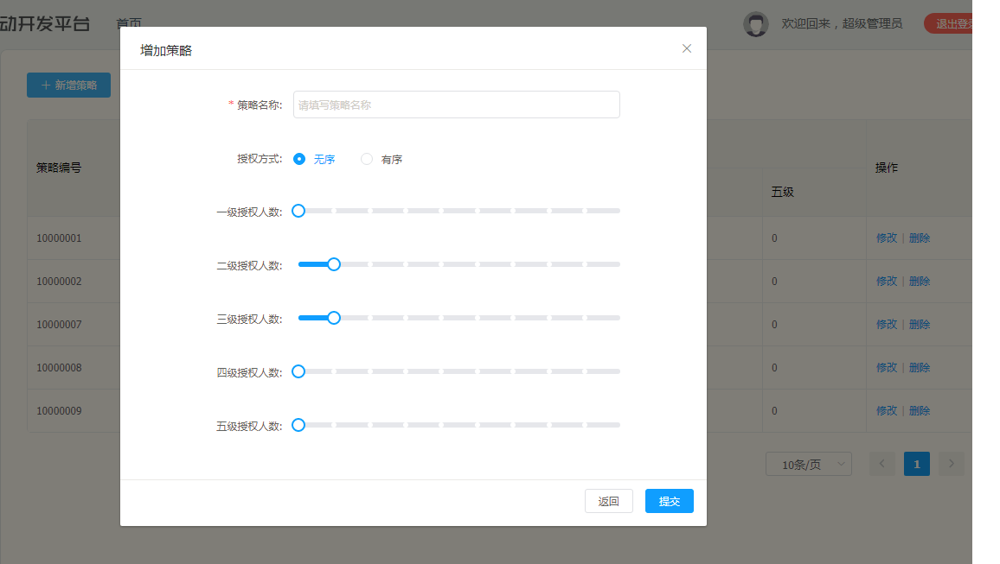
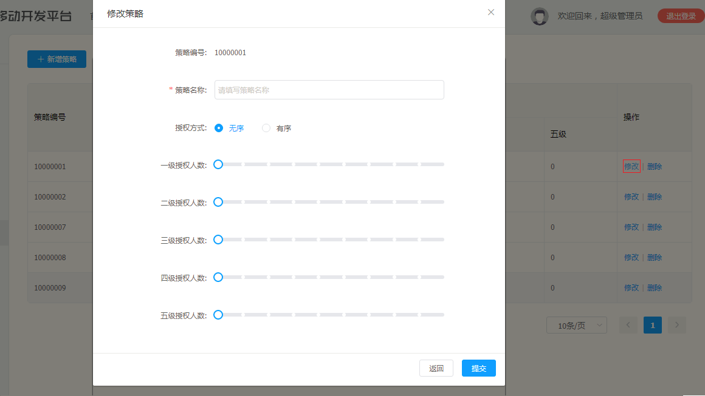
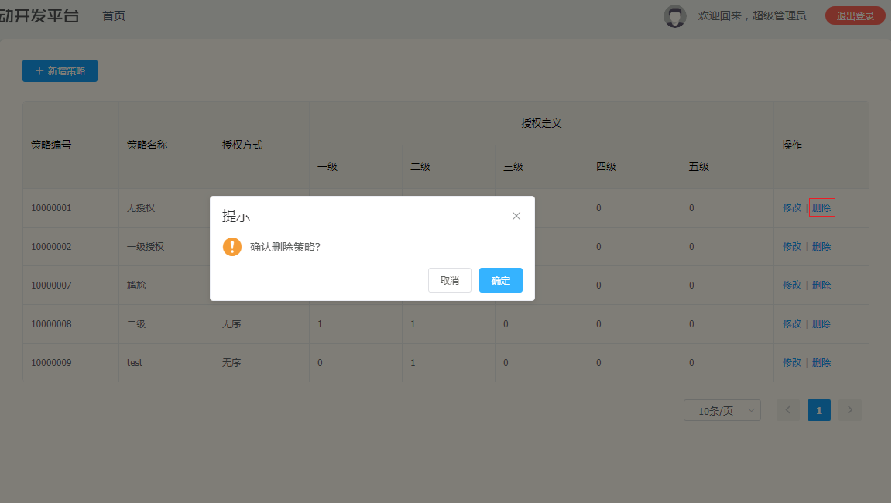

# 策略设置

策略设置是基础功能，用户可以为策略定义相关的属性

策略设置功能：

* 查看策略列表
* 新建策略
* 修改策略
* 删除策略

## 策略设置操作说明

---

进入 flame 内管控制台，点击左侧导航栏中的 **策略管理** > **策略设置**

步骤 1 策略设置列表

步骤 2 点击**新建策略**，根据所需要的数据填入表单，点击**提交**

步骤 3 点击**修改**，修改其数据，点击**提交**

步骤 4 点击**删除**，删除指定的策略

