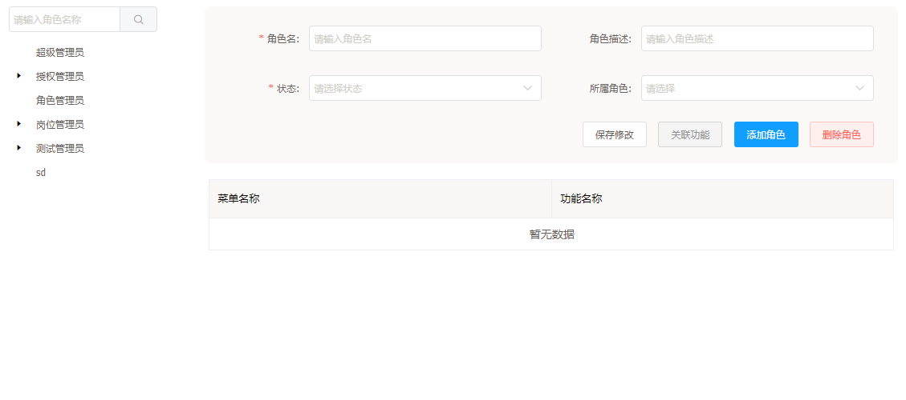
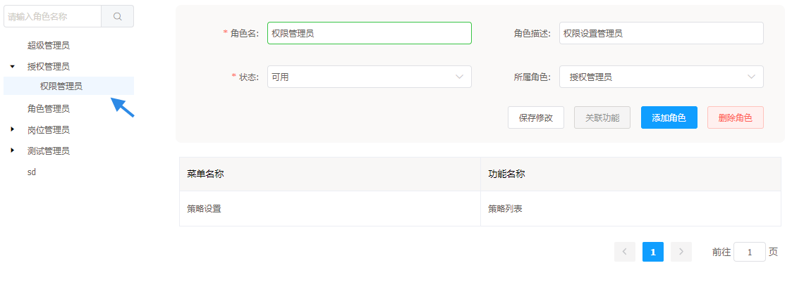
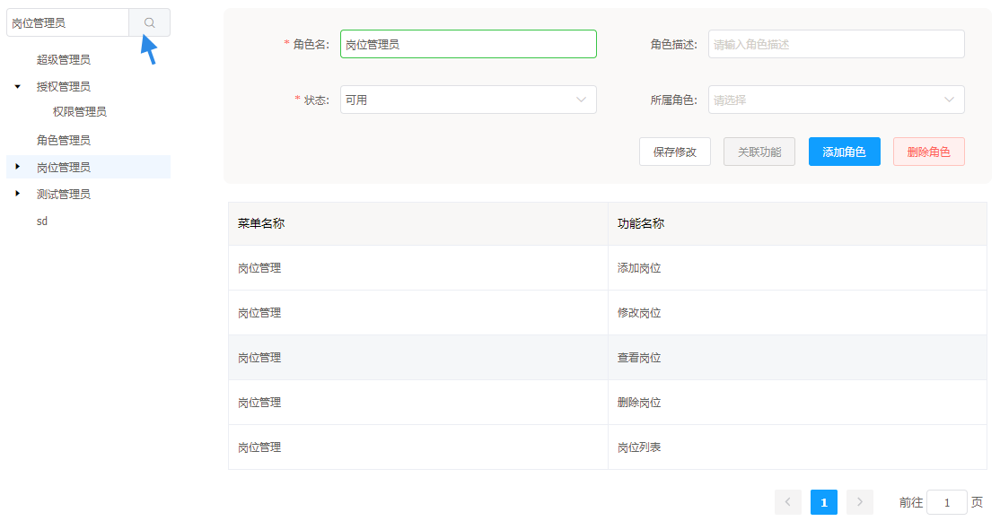
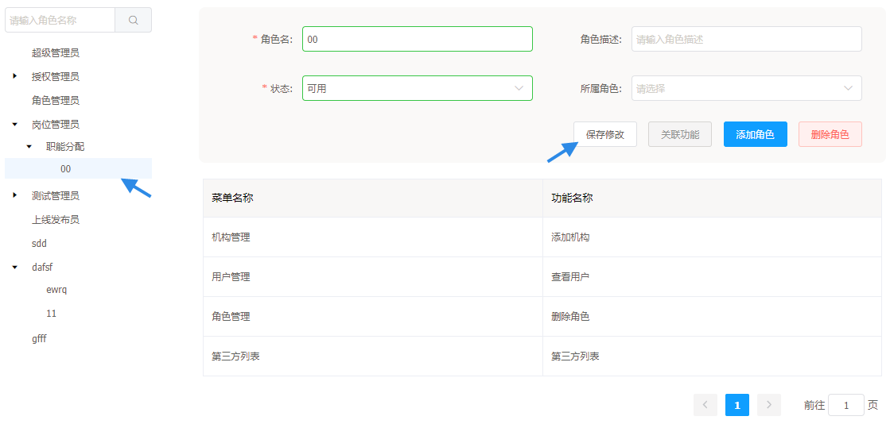
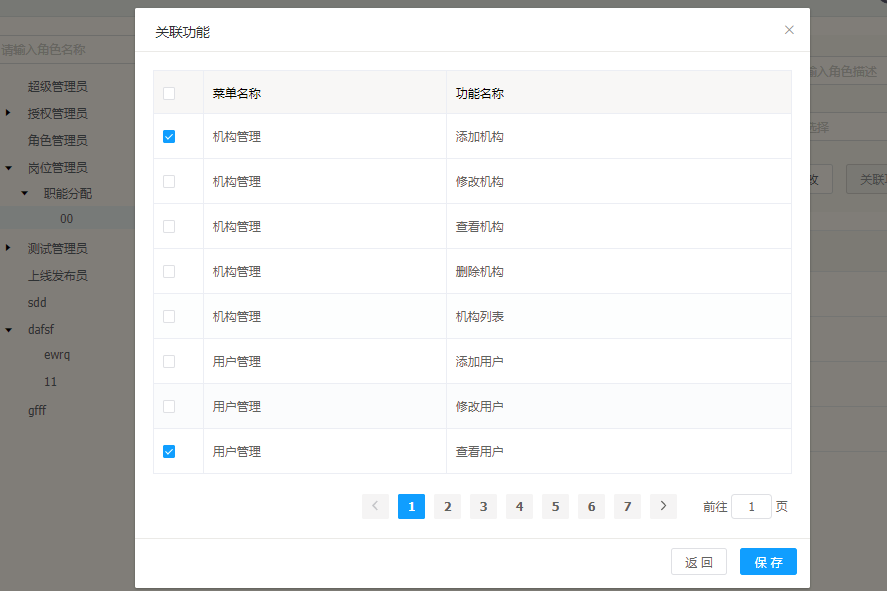
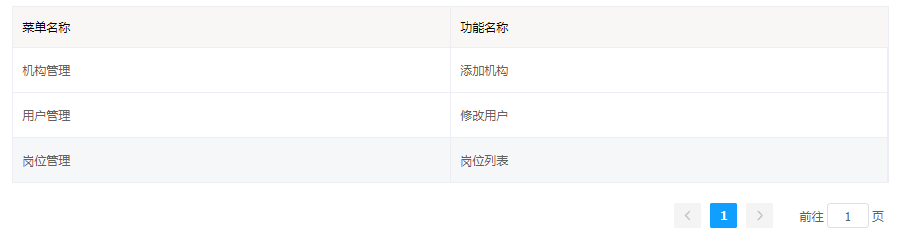
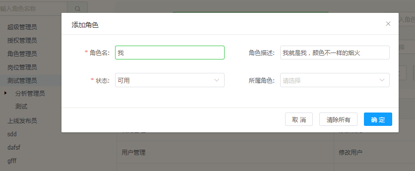
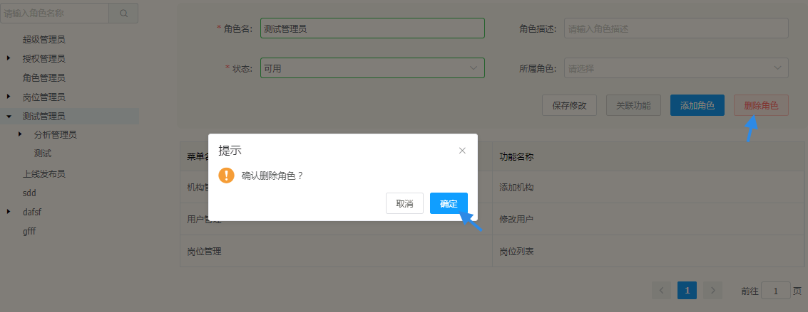

# 角色管理

角色管理功能是对客户端不同用户角色信息及具有的权限的管理，基于角色的访问控制方法还可以很好的地描述角色层次关系,实现最少权限原则和职责分离的原则。同时为了降低复杂性，平台最终统一使用了角色来对用户进行分类授权。

## 角色管理的功能

---

* 角色查询、角色信息查询
* 角色信息修改
* 角色绑定功能
* 添加角色
* 删除角色

## 发布管理的操作说明

---

进入 Flame 内管控制台，点击左侧导航栏中的**角色管理**

步骤 1 进入角色管理

步骤 2 点击左侧角色树 或 快速搜索角色名查看角色具体信息

* 角色具体信息包括：角色名、角色描述、状态是否可用、角色所属的上级角色名以及角色所包含的功能

方法一：

方法二：

> 注意：下面的操作是在步骤1 和 步骤2 的基础上进行的

功能1 **保存修改**

* 进行了前面步骤1、2的操作后，再进行角色信息的修改，后面功能同此操作

* 填写好角色信息，点击 > 保存修改 <

功能2 **关联功能**

* 点击 > 关联功能 < 在对话框中的列表中勾选出选中的角色的要绑定的功能，点击保存

* 角色绑定的所有功能都会在角色页面的表格中显示

功能3 **添加角色**

* 点击 > 添加角色 < 在对话框中的填写角色信息，点击确认

> 注意：如果在添加角色中所属角色没有勾选，默认最优先级角色

功能34 **删除角色**

* 在确认要删除的角色后，点击 > 删除角色 < ，点击确认

> 注意：如果在添加角色中所属角色没有勾选，默认最优先级角色

